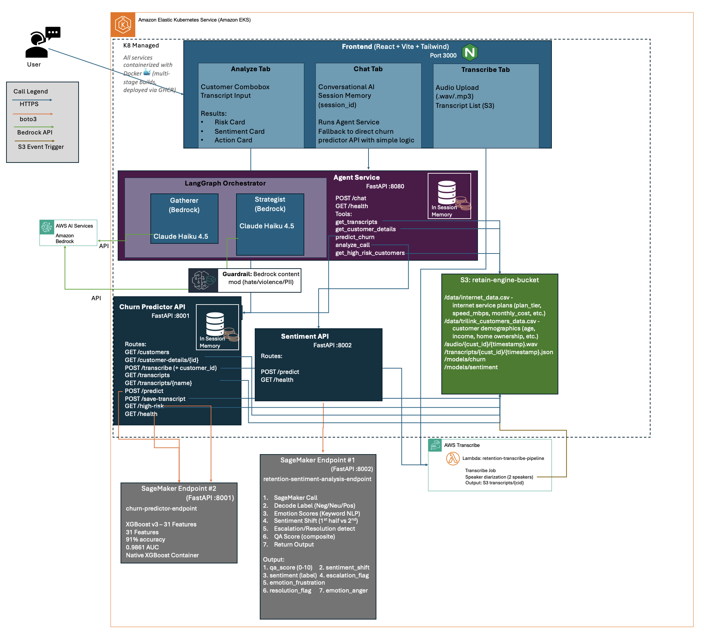
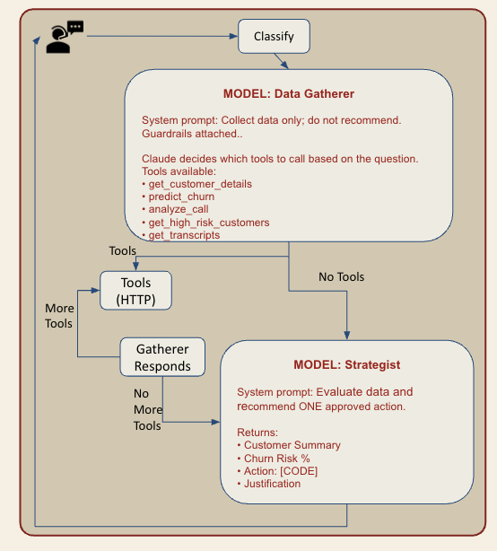

# **Capstone-Churn**

_A cloud‑native, end‑to‑end churn prediction and call‑center analytics platform._


---

# Overview

**Capstone‑Churn** is a full‑stack, cloud‑native machine learning system designed to:

- Predict customer churn
- Analyze call‑center transcripts
- Detect sentiment, frustration, escalation, and agent behavior
- Provide real‑time insights through a modern frontend
- Deploy ML models to AWS SageMaker
- Run microservices on Kubernetes
- Automate infrastructure with Terraform

This project integrates **ML**, **NLP**, **MLOps**, **DevOps**, and **cloud infrastructure** into a cohesive, production‑ready platform.

---

# Features

### ML & NLP

- XGBoost churn prediction model
- Transformer‑based sentiment + emotion classifier
- Transcript ingestion + processing pipeline
- Real‑time inference APIs
- Feature engineering + schema validation
- MLflow experiment tracking

### Cloud Infrastructure

- AWS SageMaker model deployment
- EKS Kubernetes cluster
- ALB ingress controller
- Terraform‑managed infrastructure
- Lambda‑based transcription pipeline

### Microservices

- **agent‑service** (LLM‑powered retention agent)
- **churn‑predictor‑api**
- **sentiment‑analysis‑api**
- **transcribe‑pipeline** (Lambda)
- Backend routing + frontend service

### Frontend

- React + TypeScript + Vite
- Real‑time transcript viewer
- Churn prediction dashboard
- Agent‑assist tools

### Developer Experience

- Dockerized services
- Local development via `docker-compose`
- Kubernetes manifests for all services
- Automated deployment scripts
- Clear IaC separation

---

# Architecture Overview



---

# Retention Agent Workflow (LangGraph)



*The retention agent is a LangGraph state machine with two LLM nodes. The Data Gatherer collects customer data by calling tools (`get_customer_details`, `analyze_call`, `predict_churn`, `get_high_risk_customers`, `get_transcripts`) behind a Bedrock guardrail and loops until it has enough data. It then hands off to the Strategist, which evaluates the gathered data and selects a single approved retention action with a short justification. Per-session conversation memory is maintained by LangGraph's `MemorySaver` checkpointer keyed by `session_id`.*

---

# Tech Stack

### **Languages**

- Python
- TypeScript
- Shell
- HCL (Terraform)

### **ML / NLP**

- XGBoost (churn classifier)
- PyTorch + Hugging Face Transformers (sentiment classifier)
- LangChain + LangGraph (retention agent state machine)
- AWS Bedrock — Claude (agent LLM)
- LangSmith (agent tracing and observability)
- SageMaker SDK (model packaging and deployment)

### **Infrastructure**

- AWS (SageMaker, Lambda, S3, EKS, IAM, ALB)
- Kubernetes
- Terraform
- Docker

### **Frontend**

- React + TypeScript
- Vite
- TailwindCSS

---

# Data

Training data is adapted from the IBM **Telco Customer Churn** dataset (Steven Macko, IBM Community, July 2019):
<https://community.ibm.com/community/user/blogs/steven-macko/2019/07/11/telco-customer-churn-1113>

The dataset was extended with synthetic call transcripts and sentiment labels (`sagemaker/sentiment/data/call_transcripts.csv`) to train the call-center analytics components.

---

# Model Details

## **1. Churn Prediction Model**

**Location:** `sagemaker/churn/`

### Model Type

- XGBoost classifier
- Trained on customer metadata + behavioral features

### Features

Loaded from `feature_columns.json`:

- Tenure
- Contract type
- Monthly charges
- Payment method
- Support call frequency
- Account flags
- Encoded categorical fields

### Artifacts

- `churn_model.joblib`
- `label_encoders.json`
- `feature_columns.json`

### Deployment

- Packaged via `setup.py`
- Deployed to SageMaker using `deploy.py`
- Served via `churn-predictor-api` microservice

---

## **2. Sentiment Analysis (2-Layer Design)**

**Location:** `sagemaker/sentiment/` (training + model artifacts) and `services/sentiment-analysis-api/` (inference wrapper)

The sentiment service is intentionally split into two layers: a transformer for semantic classification, and a deterministic rule-based wrapper for behavioral enrichment. This separation keeps the neural model focused on what transformers do well (sentiment polarity) while making the downstream signals (escalation, resolution, QA score) transparent and auditable.

### Layer 1 — Transformer (SageMaker endpoint)

- Fine-tuned transformer deployed to SageMaker as `retention-sentiment-analysis-endpoint`
- Produces **3-class sentiment classification**: Negative / Neutral / Positive, with a confidence score
- Input: raw call transcript (JSON)
- Output: `{ sentiment: 0 | 1 | 2, confidence: float }`

### Layer 2 — NLP enrichment wrapper (FastAPI)

Implemented in `services/sentiment-analysis-api/app_enriched.py`. Takes the transcript plus Layer-1's sentiment and confidence, and produces behavioral features using keyword matching and rule-based scoring:

- `emotion_frustration`, `emotion_anger`, `emotion_joy`, `emotion_sadness`, `emotion_fear`
- `sentiment_shift` — polarity delta between first and second half of the transcript
- `escalation_flag` — detects supervisor requests, cancellation threats, and legal mentions
- `resolution_flag` — detects positive acknowledgments in the closing segment of the call
- `qa_score` — composite 0–10 score combining sentiment, emotion, escalation, and resolution

This layer is deterministic and contains no neural model. It is the API contract surface consumed by the churn predictor and retention agent.

### Artifacts

- `model.tar.gz` — HuggingFace model package (tokenizer + weights + `inference.py`)
- `sentiment_columns.json`, `sentiment_schema.json`, `label_encoders.json` — feature/label metadata

### Training

- Notebook: `sentiment_training.ipynb`
- Script: `sentiment_training.py`

### Deployment

- Packaged via `requirements.txt` + `inference.py`
- Deployed to SageMaker using `deploy.py`
- Served via the `sentiment-analysis-api` FastAPI wrapper

---

# Quick Start

## 1. Clone the repository

```bash
git clone https://github.com/Lumin33r/Capstone-Churn
cd Capstone-Churn
```

## 2. Local development (Docker Compose)

```bash
docker-compose up --build
```

## 3. Frontend development

```bash
cd frontend
npm install
npm run dev
```

---

# Deployment

## 1. Provision AWS Infrastructure (Terraform)

```bash
cd terraform
terraform init
terraform apply
```

Creates:

- EKS cluster
- ALB ingress
- IAM roles
- S3 buckets
- SageMaker endpoints
- Lambda transcription pipeline

---

## 2. Deploy ML Models to SageMaker

```bash
cd sagemaker/churn
python deploy.py

cd ../sentiment
python deploy.py
```

---

## 3. Deploy Microservices to Kubernetes

```bash
kubectl apply -f k8s/
```

---

# Testing

### Unit Tests

```bash
pytest
```

### Integration Tests

- API endpoint tests
- Model inference tests
- Lambda local tests (`transcribe-pipeline/test_local.py`)


# Project Structure

```
Capstone-Churn/
├── frontend/               # UI
├── services/               # Microservices
├── sagemaker/              # ML models + training + deployment
├── k8s/                    # Kubernetes manifests
├── terraform/              # Infrastructure as code
├── scripts/                # Utility scripts
├── docs/                   # Documentation
└── docker-compose.yml      # Local dev
```

---

# Contributing

1. Fork the repo
2. Create a feature branch
3. Follow Conventional Commits
4. Run tests + linting
5. Submit a PR

---


# Security

- Secrets stored in AWS Secrets Manager or Kubernetes Secrets
- IAM least‑privilege roles
- No credentials committed to Git
- Container image scanning recommended

---

# License

This project is licensed under the **MIT License**. See the [LICENSE](LICENSE) file for the full text.

The MIT License permits anyone to use, copy, modify, and distribute this code — including for commercial purposes — provided the copyright notice is preserved. There is no warranty. Chosen for its simplicity and to maximize reusability by future students, contributors, and reviewers.

